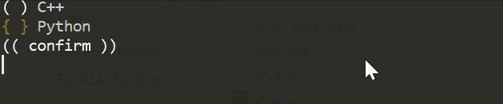
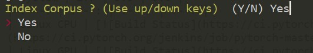
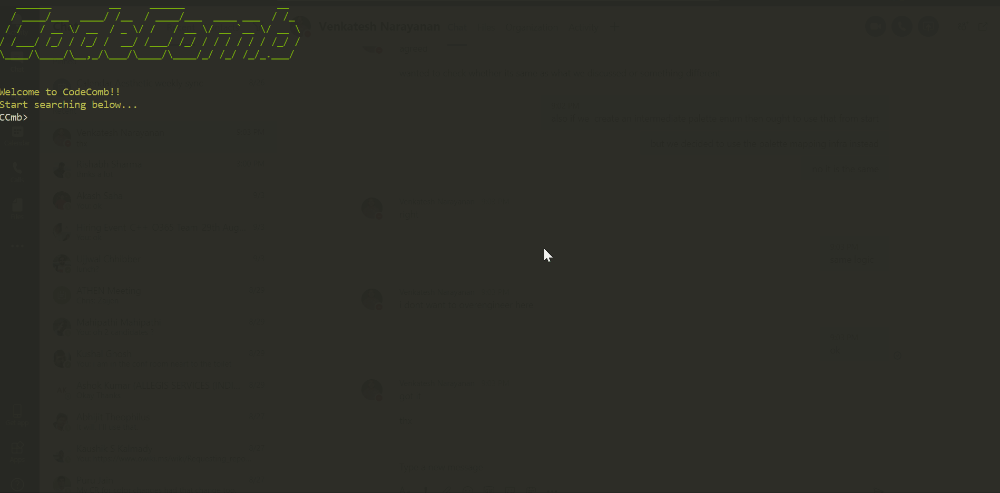

# CodeComb

## Introduction
Codecomb is a CLI tool to search your repo with natural language queries.
Can also be used as a library to add NLP search functionality to existing code browsers.

## How is it different from existing search ?
Most of the software development activities involve code reading to understand the existing system. Documentation of every module might not be possible.  

And to make the most out of code browsing or searching tools you need to know the particular keywords that might be related to the area you are looking for. 
Unfortunately, you might not have idea of what exact keywords to search for every time. And since most of the search tools adopt exact string matching, you may not get the relevant files required for your purpose or may be no files at all.

## Installation

### Prerequisites
Before you install we need to admit some assumptions we have made so far.

- Code is readable in english. We need natural language variable names, functions, comments
- Python 3.4+  (Recommend [Anaconda](https://www.anaconda.com/distribution/) for Windows)
- ANSI CLI (cmd should work, but I highly Recommend [cmder](https://cmder.net) for Windows)
- Current editor support - VSCode / Vim only
- This is Language agnostic. But this initial release reads only .py and .cpp extensions

### Install
- Install [python3](https://www.python.org/downloads/) ( [Conda](https://www.anaconda.com/distribution/) for Windows users) 
- Install pip ( [Linux](https://www.tecmint.com/install-pip-in-linux/) | [Windows](https://www.liquidweb.com/kb/install-pip-windows/) )
- Install codecomb and its dependencies `pip install CodeComb`

That's all!

## Usage

### First time
The intended use of codecomb is through its CLI.

1. Go to your intended folder and `codecomb shell`
2. This will open the first time config options. Choose your editor and formats you want to support.

3. Select "Yes" for "Index your folder". This will take time depends on no. of files.

4. Upon completion. Press enter to goto search mode.
5. Each search results opens in editor you have chosen in (2)

### Later Onwards

Step (2) is skipped. Directly goto search mode (with an option to re-index if required (3))

## FAQs

1. **Why CLI ?**

Simplicity was our prime concern. We wanted a **cscope** equivalent for natural language queries.

2. **Why not elasticsearch / Apache Solr etc. ?**

These tools are indispensable when working with repos not in your system.
But, often times we need to tinker with our local source code.( eg. - After git clone new github project ??)
CodeComb is suitable for such scenarios.

3. **Why not ripgrep with fuzzy search??**

This is definitely an option. But we want to go beyond fuzzy string search.
A semantic similarity can find the relation between `Draw` and `Paint` which a plain string search cannot have.
Although we are thinking of a possibility to functionalities of ripgrep and other search.

4. **How does it work ??**

To put it in few words - we embed the documents and queries with word embeddings and find a suitable similarity score (cosine etc.) between them.

5. **Any plans for GUI support??**

We are prototyping a React-based frontend and a VSCode plugin. More on this soon!
